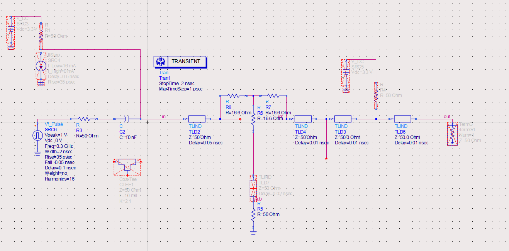

# 高速数字端接及耦合问题

## 简述端接

1. 阻抗匹配: 高速数字芯片产生的方波上升沿较快, 高频率谐波含量高, 而高频率的信号遇到阻抗不连续点会产生反射, 导致信号畸形, 继而可能引发信号完整性问题
2. 偏置电压: 高速数字芯片内部的功能器件为高速晶体管, 为使晶体管工作在最佳状态, 输出需添加一定的偏置电压

## 耦合考量

### 交流耦合

交流耦合即在输出串联一个电容, 起到隔直作用

#### 原理

在高速芯片中晶体状态切换时, 

其原理是, 由于源端和负载端静态工作下存在电压差, 在输入信号突变(边沿变化)时, 电容两端的电压却不会立即变化, 而会维持该电压差, 因此, 隔直本质上是维持源端和载端间的电压不变, $\textcolor{red}{负载端的输出 = 源端输出 - 电容电压}$

那电容隔直之后的波形应该是什么样的? -> 以 偏置电压(VT) 为中心的波形

**电容隔直的本质是使电压波对偏置电压(VT)的积分为 0**. 当源端电压波状态切换时, 电容电压虽然不会立即变化, 但由于此时电容在负载端的电压比 VT 高(低), 就会在两者间形成一个电流通路. 电容上的电荷通过此方式逐渐释放, 并最终与 VT 完全一致. 当然, 源端的电压肯定是按照一定频率变化的, 也就是说正常情况下电容负载端电压并不会完全与 VT 一致. 这时便要说到波形的漂移.

刚上电时, 负载端电压等于 VT, 当源端电压波变化时, 负载端也会随着变化, 假设源端电压为 0-0.5V 方波, VT=1V, 则最开始时, 负载端电压将是 1-1.5V(为什么?因为瞬态下电容两端电压不变). **而电容的放电, 会导致波形对偏置电压的积分会逐渐趋近于 0**, 如下图所示:

$\textcolor{red}{所以仿真的时候切记如果想看长时间后的结果, 需要先运行一段时间, 因为最开始的瞬态响应的电压波范围不是稳态下的值}$

## 布局考量

### 端接电阻尽量靠近芯片

> 这是为了防止 stub 对信号造成影响
> 
> 虽然端接电阻可以吸收反射的信号, 但是由于 T 型结的存在, 仍然会使信号有一定变形, 典型的电路结构图如下: 
> 
> 
> 
> 图中 out2 的这条路径就属于 stub, 也即是为端接区域. 该仿真电路图中 stub 长度为 30ps
> 
> 该结构下的仿真波形如下: 
> 
> 
> 
> 当减少 stub 长度, 延迟时间为 10ps 后, 仿真波形如下: 
> 
> 
> 
> 可以看到波形有明显改善, 但是仍然存在波形变形. 最理想的条件下无 stub, 波形将会是完美的上升沿
> 
> 出现波形变形的原因是 T 型结, 该结会引入阻抗不连续点, 导致源端产生负压反射, 而 T-Junction 的其他两路则有着相同的电压波形
> 
> (待测试)仿真证明, 通过添加简易功分结构可解决该问题
> 
> 
> 
> 
